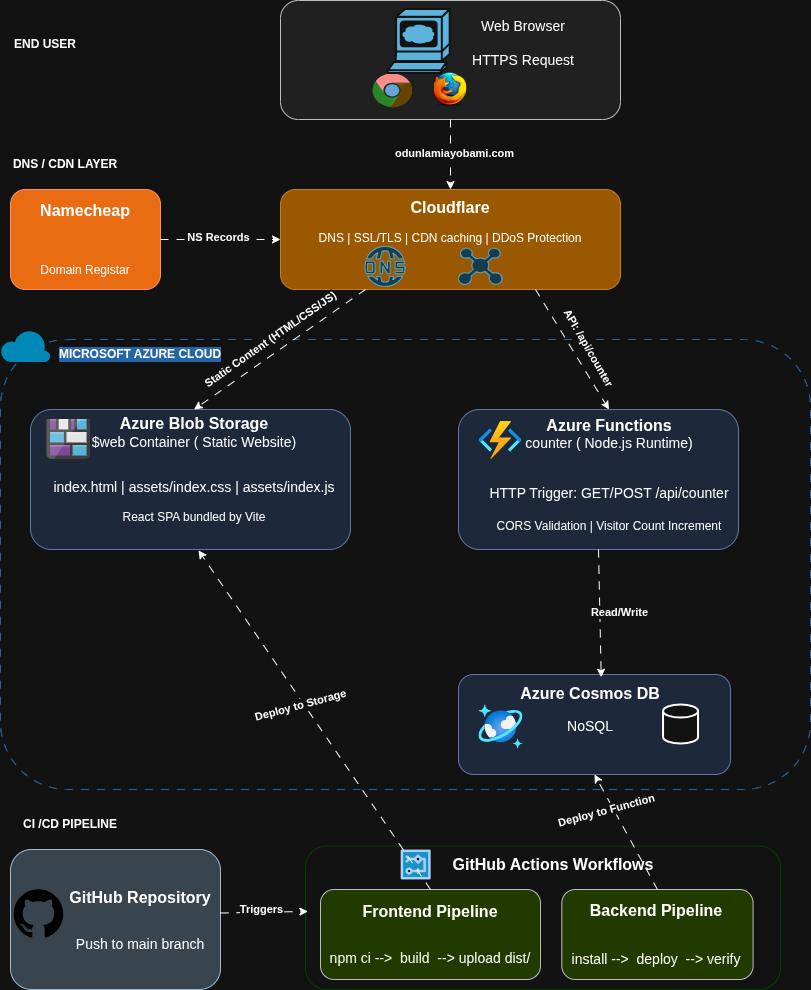

# DevOps Portfolio Website

A personal portfolio website for showcasing DevOps and cloud engineering expertise, built with React and TypeScript, hosted on Azure Static Website (Blob Storage), with a serverless Azure Function backend for visitor tracking.

**Live site:** [odunlamiayobami.com](https://odunlamiayobami.com)

## Architecture

<p align="center">
  
</p>

Both the frontend and backend are deployed automatically via **GitHub Actions** on push to `main`.

## Tech Stack

### Frontend

| Technology | Purpose |
|---|---|
| React 19 | UI library |
| TypeScript 5.9 | Type safety |
| Vite 8 | Build tool & dev server |
| Tailwind CSS 4 | Utility-first styling |
| React Router 7 | Client-side routing (HashRouter) |
| Lucide React | Icon library |

### Backend

| Technology | Purpose |
|---|---|
| Azure Functions (Node.js) | Serverless API |
| Azure Cosmos DB | NoSQL database for visit counts |
| Jest | Unit testing |

### Infrastructure & CI/CD

| Technology | Purpose |
|---|---|
| Azure Blob Storage | Static website hosting |
| Cloudflare | CDN & cache |
| GitHub Actions | CI/CD pipelines |

## Features

### Dark / Light Mode

The site supports a toggleable dark and light theme. Clicking the sun/moon icon in the navbar switches between modes. The user's preference is saved to `localStorage` and persists across visits.

**How it works:**
- `src/context/ThemeContext.tsx` manages theme state and sets a `data-theme` attribute on `<html>`
- CSS custom properties in `src/index.css` define color tokens for each theme
- Themed utility classes (`.bg-theme`, `.text-theme-primary`, `.border-theme`, etc.) are used across all components
- Transitions are smooth (300ms) for a polished experience

### Visitor Counter

A serverless Azure Function tracks and displays visit counts on the home page. The counter increments on each visit and stores data in Azure Cosmos DB.

### Responsive Design

Mobile-first layout with Tailwind CSS breakpoints. Navbar collapses to a hamburger menu on mobile. Project grids adapt from 1 to 3 columns.

## Project Structure

```
my-site/
├── src/
│   ├── components/            # Reusable UI components
│   │   ├── Navbar.tsx         # Sticky nav with mobile menu & theme toggle
│   │   ├── Footer.tsx         # Footer with social links
│   │   ├── ProjectCard.tsx    # Project listing card
│   │   ├── SectionHeading.tsx
│   │   ├── TechBadge.tsx
│   │   ├── ThemeToggle.tsx    # Dark/light mode toggle button
│   │   └── VisitorCounter.tsx
│   ├── context/
│   │   └── ThemeContext.tsx    # Theme state management & localStorage persistence
│   ├── pages/
│   │   ├── Home.tsx           # Hero, tech stack, certifications
│   │   ├── Projects.tsx       # Project grid
│   │   ├── ProjectDetail.tsx  # Individual project view
│   │   └── Resume.tsx         # Experience, skills, education
│   ├── data/
│   │   ├── projects.json      # Project content data
│   │   └── resume.ts          # Resume content data
│   ├── services/
│   │   └── visitorCounter.ts  # API client for visitor counter
│   ├── config.ts              # App configuration
│   ├── App.tsx                # Router & layout
│   ├── main.tsx               # Entry point (wraps app in ThemeProvider)
│   └── index.css              # Tailwind imports, theme variables & animations
├── backend/
│   └── api/
│       ├── src/
│       │   └── functions/
│       │       └── UpdateCounter.js  # Visitor counter function
│       ├── test/
│       │   └── unit/
│       │       └── updateCounter.test.js
│       ├── host.json
│       └── package.json
├── .github/workflows/
│   ├── frontend.main.yaml     # Build & deploy frontend
│   └── backend.main.yaml      # Deploy Azure Function
├── public/
│   ├── images/                # Architecture diagrams
│   ├── favicon.svg
│   └── icons.svg
├── vite.config.ts
├── package.json
└── tsconfig.json
```

## Getting Started

### Prerequisites

- [Node.js](https://nodejs.org/) (v20 or later)
- npm

### Local Development

1. **Clone the repository:**
   ```bash
   git clone https://github.com/HayBam/azure-resume.git
   cd azure-resume
   ```

2. **Install dependencies:**
   ```bash
   npm install
   ```

3. **Start the dev server:**
   ```bash
   npm run dev
   ```
   The site will be available at `http://localhost:5173`.

4. **Build for production:**
   ```bash
   npm run build
   ```
   Output is generated in the `dist/` folder.

### Backend (Azure Function)

1. **Navigate to the backend:**
   ```bash
   cd backend/api
   npm install
   ```

2. **Set up environment variables** (create a `.env` file in `backend/api/`):
   ```
   COSMOS_CONNECTION_STRING=<your-cosmos-db-connection-string>
   COSMOS_DATABASE_NAME=resumeVisitsDb
   COSMOS_CONTAINER_NAME=visitors
   ```

3. **Run tests:**
   ```bash
   npm test
   ```

## Pages

| Page | Route | Description |
|---|---|---|
| Home | `/` | Hero section, core technologies, certifications, "What I Do" highlights, visitor counter |
| Projects | `/projects` | Responsive grid of DevOps/cloud project cards |
| Project Detail | `/projects/:id` | Full project description, tech stack, architecture diagram, documentation |
| Resume | `/resume` | Work experience, certifications, technical skills, education |

## CI/CD Pipelines

### Frontend (`frontend.main.yaml`)

Triggers on push to `main` when frontend files change (`src/`, `public/`, config files).

**Steps:** Checkout → Setup Node.js → `npm ci` → `npm run build` → Azure Login → Upload `dist/` to Azure Blob Storage (`$web` container) → Purge Cloudflare cache → Logout

**Required GitHub Secrets:**
- `AZURE_CREDENTIALS` — Azure service principal credentials
- `STORAGE_ACCOUNT_NAME` — Azure Storage account name
- `CLOUDFLARE_ZONE_ID` — *(optional)* Cloudflare zone ID
- `CLOUDFLARE_API_TOKEN` — *(optional)* Cloudflare API token

### Backend (`backend.main.yaml`)

Triggers on push to `main` when backend files change (`backend/api/`).

**Steps:** Checkout → Azure Login → Setup Node.js → `npm install --production` → Deploy to Azure Functions → Verify deployment → Logout

**Required GitHub Secrets:**
- `AZURE_CREDENTIALS` — Azure service principal credentials

## Visitor Counter API

The backend exposes a single endpoint:

```
GET/POST https://resume-counter.azurewebsites.net/api/counter
```

**Response:**
```json
{
  "success": true,
  "count": 42,
  "lastUpdated": "2026-03-18T19:00:00Z",
  "source": "Azure Cosmos DB",
  "database": "azureresume",
  "container": "counter"
}
```

CORS is restricted to `https://odunlamiayobami.com` and `https://www.odunlamiayobami.com`.

## Updating Content

All site content is driven by data files — no need to modify component code:

- **Projects** — edit `src/data/projects.json`
- **Resume** (experience, certifications, skills, education) — edit `src/data/resume.ts`
- **Site config** (name, title, social links) — edit `src/config.ts`

## License

This project is private and not licensed for redistribution.
